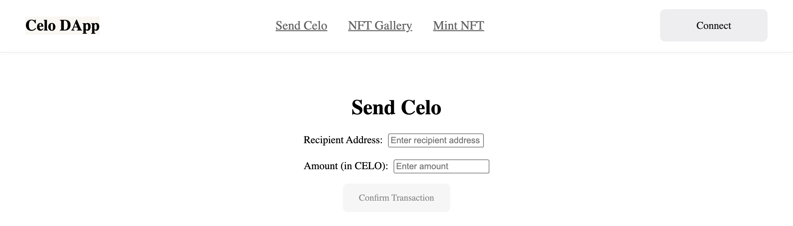
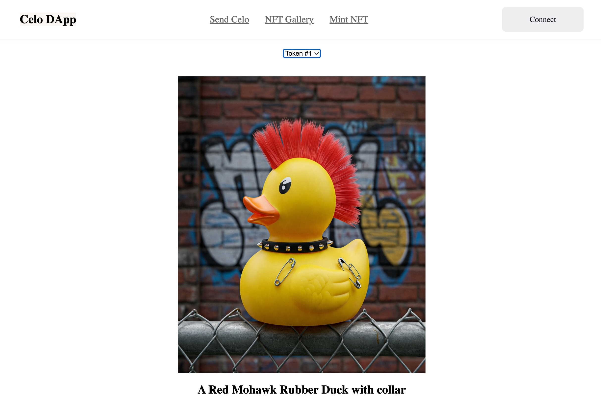
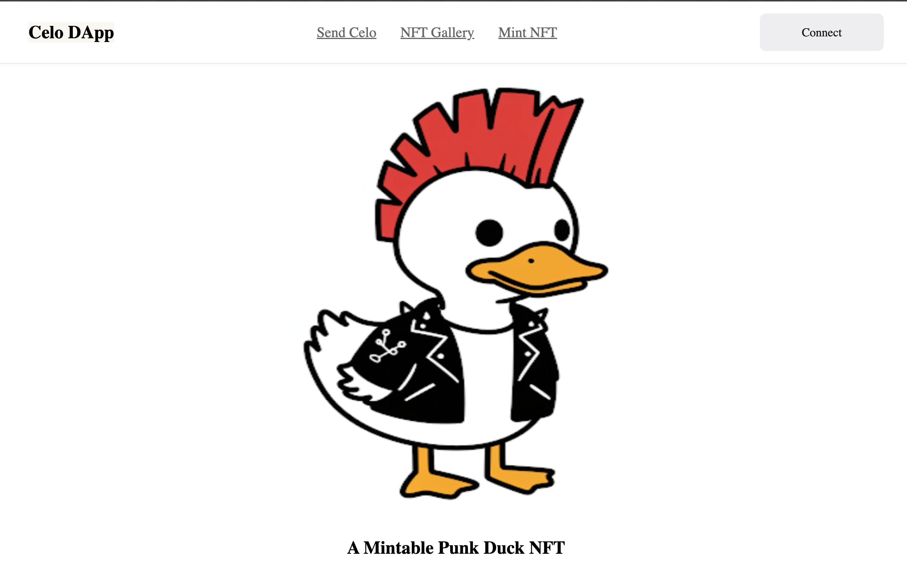

# celo-one-click-deploy
Using Celo and Thirdweb create a Celo Token Transfer, an NFT Gallery and an Mintable NFT

## Instructions

- Create an NFT Drop project on Thirdweb on Celo Alfajores
- Get a Thirdweb Client ID
-  Clone the repository
-  Create a .env file with the following:

```
VITE_CLIENTID = THIRD_WEB_CLIENT_ID
VITE_ADDRESS = MINTABLE_NFT_CONTRACT
VITE_GALLERY_ADDRESS = NFT_GALLERY_CONTRACT
VITE_ADDRESS_TO = ACCOUNT_TO_SEND_CELO_TO
```
-  run 
```
npm install
```
- run
```
npm run dev
```






